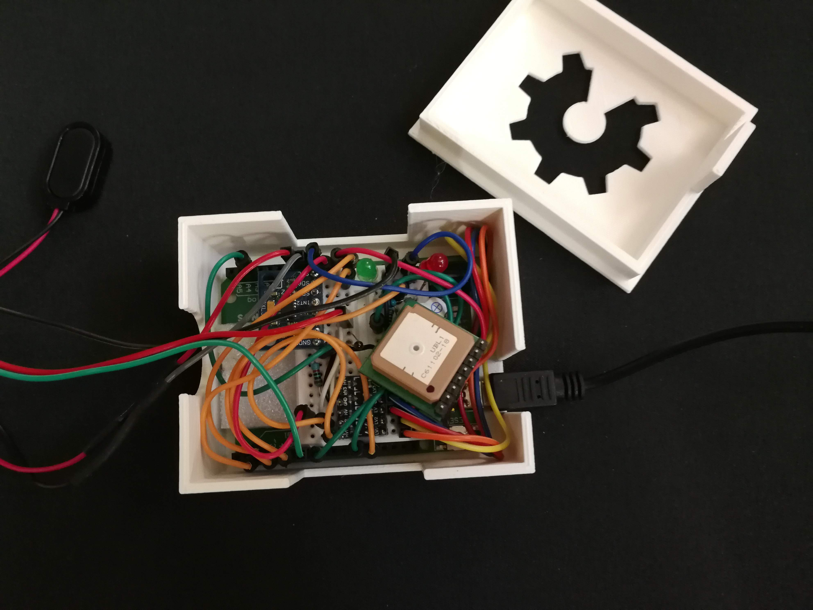
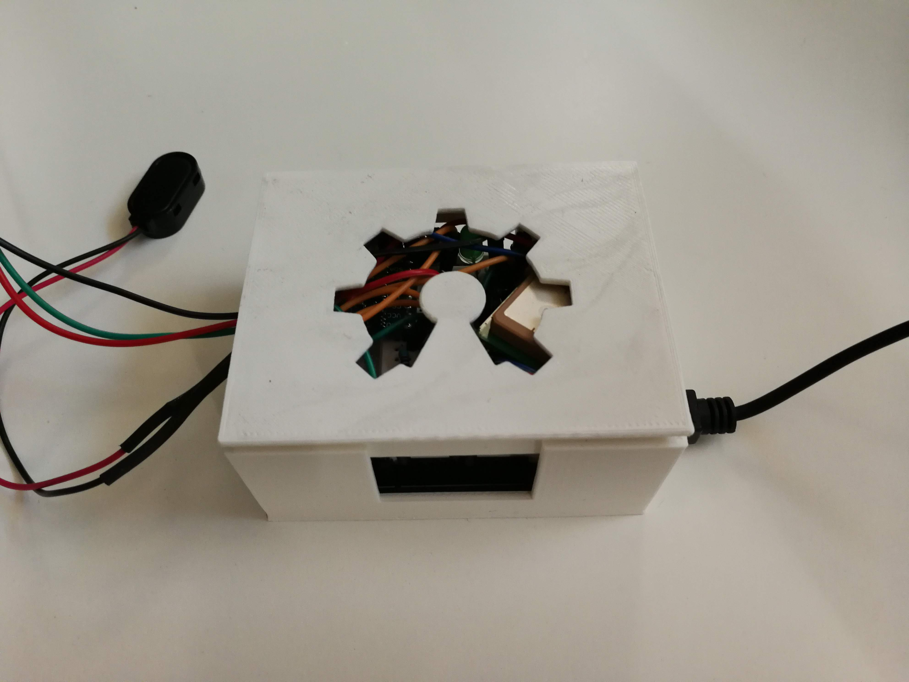
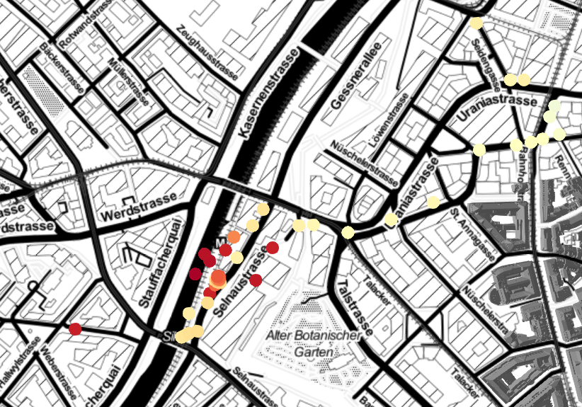

# CharIoTeer

Smart last-mile delivery project @MakeZurich

CharIoTeer is a contribution to the long-standing quest of making delivery smart. By measuring critical indicators of package health (temperature of goods, ambient temperature, humidity, position) together with geographical coordinates. The project provides real-time actionable data for inner-city logistics of high-value shippments (medicines, blood, valuable documents, groceries, cigars,... ).

# Building CharIoTeer

Building CharIoTeer is simple and fun! The following sections take you step by step through the process.


## Bill of Materials:

* [The Things Network Uno](https://www.thethingsnetwork.org/docs/devices/uno/)
* [ADXL345](https://www.sparkfun.com/datasheets/Sensors/Accelerometer/ADXL345.pdf) Accelerometer
  * alternatively simple [tilt switch](https://learn.adafruit.com/tilt-sensor/using-a-tilt-sensor) may be enough
* [DHT11](http://www.circuitbasics.com/how-to-set-up-the-dht11-humidity-sensor-on-an-arduino/) Temperature and Humidity Sensor
* [Sensirion SHTxx](https://github.com/rac2030/MakeZurich/wiki/SHT31) Temperature and Humidity Sensor
  * alternatively plain [thermistor](http://www.circuitbasics.com/arduino-thermistor-temperature-sensor-tutorial/) will do
* [u-blox PAM-7Q](https://www.u-blox.com/sites/default/files/PAM-7Q_DataSheet_(UBX-13002455).pdf) GPS sensor
* Buzzer, LEDs, Resistors, Jumper Wires, Breadboard, Battery Power Supply
* PLA for 3D printed casing

## Getting Started

Before starting the project, check that your area has [loRaWAN coverage](https://www.thethingsnetwork.org/map). Consider [joining the movement](https://www.thethingsnetwork.org/community) and [building your very own gateway](https://github.com/ttn-zh/ic880a-gateway/wiki). Do some [quick reading](https://www.thethingsnetwork.org/docs/lorawan/) on how LoRaWAN works.

Once your hardware arrives, put it all together:

## Wiring the Arduino

*Note that despite being named The Things Network UNO (TTN Uno), the board is actually a Arduino Leonardo (with ??? chip). To make this clear, I name TTN Uno TTN Leanardo instead.*



**ADXL345** | Arduino UNO | TTN Leonardo
:---:|:---:|:---:
GND | GND | GND
VCC | 5V | 5V
CS | 5V | 5V
SDA | A4 | 2
SCL | A5 | 3


**DHT-11** | Arduino UNO (or TTN Leonardo)
:---:|:---:
\+ | 5V
\- | GND
S | 7

<!---
US100 | Arduino UNO + TTN Leonardo
:---:|:---:
VCC | 5V
GND | GND
Echo | 11
Trig | 10
-->

**u-blox PAM-7Q** | LevelConv | Arduino UNO (or TTN Leonardo)
:---:|:---:|:---:
not connected | HV | 5V
VCC | LV | 3.3V on TTN UNO
TX | LVx <-> HVx | 5
RX | LVx <-> HVx | 13


Device | (+) to board | (-) to board
:---:|:---:|:---:
**red led** | 4 trhu 220R | GND
**green led** | 8 thru 220R | GND
**active buzzer** | 12 | GND thru 100R
**themistor** | 5V | GND thru 10kR and A3

*All connections are identical for Arduino Uno and TTN Leonardo. Polarity for thermistor does not matter.*

## Understanding the Code

#### Practical
You are encouraged to develop the code in [PlatformioIO](https://platformio.org/). If you do so, check the project file `platformio.ini` and make sure it corresponds to your setup. It will handle library dependencies for you. If you are using other IDE (like [Arduino IDE](https://www.arduino.cc/en/Main/Software?)), you may need to install the libraries manually.

#### Sending Data as Bytes

LoRaWAN is a technology that is designed for small volume of transferred data. Each message sent from a device over gateway to a backend is limited to maximally 51 bytes. Preferentially, messages should not exceed 12 bytes as more data per transfer results in longer airtime of each message. Daily airtime per device is limited (see [[limitations](https://www.thethingsnetwork.org/docs/lorawan/limitations.html)] and [[fair access policy](https://www.thethingsnetwork.org/forum/t/limitations-data-rate-packet-size-30-seconds-uplink-and-10-messages-downlink-per-day-fair-access-policy/1300)], therefore messages should not be sent more frequently then every couple of minutes or less.

To reduce the amount of data being sent, I encode each message emitted by the device as bytes. The message is then decoded in a server application by applying reverse mathematical operations.

For example, encoding gographical coordinates to 3 bytes per longitude and 3 bytes latittude may look like this:

``` cpp
void add_buffer_gps(double lat, double lon){

  // offset by 90(180) to make positive and scale to 0..1
  latB = ((lat + 90) / 180.0) * pow(256,3);
  lonB = ((lon + 180) / 360.0) * pow(256,3);

  // byte shifting
  dataBuffer[0] = ( latB >> 16 ) & 0xFF;
  dataBuffer[1] = ( latB >> 8 ) & 0xFF;
  dataBuffer[2] = latB & 0xFF;

  dataBuffer[3] = ( lonB >> 16 ) & 0xFF;
  dataBuffer[4] = ( lonB >> 8 ) & 0xFF;
  dataBuffer[5] = lonB & 0xFF;
  }
```

Another example is encoding of tilt of the device as measured by accelerometer: 

``` cpp
void add_buffer_tilt(float Xg_crit, float Yg_crit, int it = 0) {
  // it, position where to start writing to the buffer
  
  // offset by 2 to assure range -1..1 becomes positive and scale to 0..1
  XgB = (Xg_crit  + 2.0) * pow(256,1) / 4;
  YgB = (Yg_crit + 2.0) * pow(256,1) / 4;
  
  // each value is just one byte
  dataBuffer[it] = XgB;
  dataBuffer[it+1] = YgB;
  }
```

#### Using Rolling Averages

I want to send message every couple of minutes but our Aurdino with sensors is capable of collecting data at much higher rate. It is advantaegous to send values averaged over several preceding measurements. This makes our measurements more accurate and helps to deal with outliying values. For example for humidity I do that as follows:

``` cpp
#include <RunningAverage.h>
#include <dht11.h> // temperature and humidity sensor
RunningAverage myRA_h(10); // 10 is size of buffer
void setup(){
  myRA_h.clear();
  }

void loop(){
  // ...
  myRA_h.addValue((float)DHT11.humidity);
  // ...
  }
```
#### Obtaining GPS Data

Check out the [working example](https://gitlab.com/mkzh-milesahead/arduino-gps) developed by @njam.

##### Using Smart Delay and Software Serial

The Arduino hardware has built-in support for serial communication on pins 0 and 1 (which also goes to the computer via the USB connection). The native serial support happens via a piece of hardware (built into the chip) called a UART. The Software Serial is used to allow serial communication on other digital pins of the Arduino,

```cpp
static const int RXPin = 13, TXPin = 5;
AltSoftSerial gpsSerial(RXPin, TXPin);

void delay_smart(unsigned long ms) {
  // This custom version of delay() ensures that the gps object is "fed"
  unsigned long start = millis(); // Get current time from board start in ms
  do {
    // wait for data available
    while (gpsSerial.available()) {
      gps.encode(gpsSerial.read());
    }
    // wait extra if needed to fill delay
  } while (millis() - start < ms);
}
```

#### Talking with The Things Network

```cpp
#include <TheThingsNetwork.h>
#include <private_keys.h> // imports appKey and appEUI from external file

#define loraSerial Serial1
#define freqPlan TTN_FP_EU868 // Use european freq plan
#define COUNT_OF(array) (sizeof(array) / sizeof(array[0])) // gets array size

TheThingsNetwork ttn(loraSerial, Serial, freqPlan);
bool is_connected = false;
uint8_t dataBuffer[12] = {0}; // uint8_t is byte, buffer can hold 12 bytes

void send_ttn_message(uint8_t* data, size_t data_size, port_t prt = 1) {
    if(is_connected){
      ttn.sendBytes(data, data_size);// sizeof(data)
    } else {
      Serial.print("ttn message: ");
      uint8_t i = 0;
      for (i = 0; i < data_size; i++){ // prints byte message in HEX encoding
        if (data[i] < 16) {
          Serial.print("0");
          Serial.print(data[i], HEX);
        } else {
          Serial.print(data[i], HEX);
        }
      }
      Serial.println("");
    }
}

void setup(){
  Serial.print("--- TTN STATUS ---"); ttn.showStatus();
  ttn.provision(appEui, appKey);
  is_connected = ttn.join(10); // try to connect up to 10 times 
  if (!is_connected){
    Serial.print("Join to TTN failed.");
  }
}

void loop(){
  // ...
  // Messaging the TTN Application
  if (iteration % send_per == 0){ // send only infrequently
    send_ttn_message(dataBuffer, COUNT_OF(dataBuffer));
  }
  // ...
}
```

More can be found on the [Quick Start](https://www.thethingsnetwork.org/docs/devices/uno/quick-start.html) site for the TTN Uno (Leonardo) device.

## Printing the Case


I wanted to have a nice casing for the project to work as tight protective enclosure and to make it all together look neat. To design the case (starting from a [template](https://www.thingiverse.com/thing:78032)) I used [OpenSCAD](http://www.openscad.org/). I sliced the `stl` files to `gcode` using [CURA](https://ultimaker.com/en/products/ultimaker-cura-software) and printed them on a 3D printer from [Teil3](https://www.teil3.ch/shop/3d-drucker.html). You will find the design in `scad` file in `hw` folder for you to adjust and play with.
 
<!-- mail guy from tel3d ..... get cura settings! -->

## Receiving and Decoding Payloads

Once the data was emitted by the .... chip, received by usually [multiple](https://www.thethingsnetwork.org/docs/network/architecture.html#de-duplication-broker)) gateways it is handed over to the backend server application. We used [The Things Network Console](https://console.thethingsnetwork.org/) to create and manage such applciation inlcuding its `decoder` , `validator` and `converter` functions.

For example the `decoder` function for geographical coordinates and for temperature looks as following (compare with encoding on Arduino above):

```js

function Decoder (bytes, port) {
  var decoded = {}
  if (port === 1) {
    if (bytes.length === 10) {
      var lat = bytesToInt(bytes.slice(0, 3)) / Math.pow(256, 3) * 180 - 90
      var lon = bytesToInt(bytes.slice(3, 6)) / Math.pow(256, 3) * 360 - 180
      if (lat !== 0 && lon !== 0) {
        decoded['lat'] = lat
        decoded['lon'] = lon
      }

      var tiltx = bytesToInt(bytes.slice(10, 11)) / Math.pow(256, 1) * 4 - 2
      decoded['tiltx'] = tiltx
      var tilty = bytesToInt(bytes.slice(11, 12)) / Math.pow(256, 1) * 4 - 2
      decoded['tilty'] = tilty
    }
  }
  return decoded
}

function bytesToInt (bytes) {
  var integer = 0
  for (var n = 0; n < bytes.length; n++) {
    integer += bytes[n]
    if (n < bytes.length - 1) {
      integer = integer << 8
    }
  }
  return integer
}
```

Here is a sample of datapoint:

```json
{"_id": "5b377f54e4d28c0006c1ab93",
  "deviceId":"ttn-uno",
  "receivedAt":"2018-06-30T13:02:12.565Z",
  "metadata":{
    "time":"2018-06-30T13:02:12.339076452Z",
    "frequency":868.1,
    "modulation":"LORA",
    "data_rate":"SF7BW125",
    "airtime":66816000,
    "coding_rate":"4/5",
    "gateways":[
      {"gtw_id":"eui-0000024b080310b1",
        "timestamp":628068507,
        "time":"2018-06-30T13:02:11.414067Z",
        "channel":0,
        "rssi":-117,
        "snr":1.5,
        "rf_chain":1,
        "latitude":47.37787,
        "longitude":8.53909,
        "altitude":433
      }
    ]
  },
  "dist":0,
  "speed":0,
  "temp-inside":16.99981689453125,
  "temp-outside":23.09722900390625,
  "tiltx":0.1875,
  "tilty":-0.203125
}
``` 
## Storing and Visualizing Data

The server application was developed by [@njam](https://github.com/njam). The full source code is available at the [project's gitlab](https://gitlab.com/mkzh-milesahead/ttn-milesahead). The visalizations are available [here](https://ttn-milesahead.herokuapp.com/).

Here is a sample visualization showing geographical coordinates as dots color-coded by temperature measured by DHT11 sensor.



## References

* [MakeZürich](https://makezurich.ch/about/)
* [The Things Network Community in Zürich](https://www.thethingsnetwork.org/community/zurich/)
* [Post kauft Logistik Startup notime](https://www.startupticker.ch/en/news/march-2018/post-kauft-logistik-startup-notime) (German)


## Team
* Martin Holub ([web](http://www.martinholub.com/about/))
* Reto Kaiser ([@njam](https://github.com/njam))
* Antonios Kouris ([crunchbase](https://www.crunchbase.com/person/antonios-kouris#section-overview))
* Charilaos ([@tsarouch](https://github.com/tsarouch))
