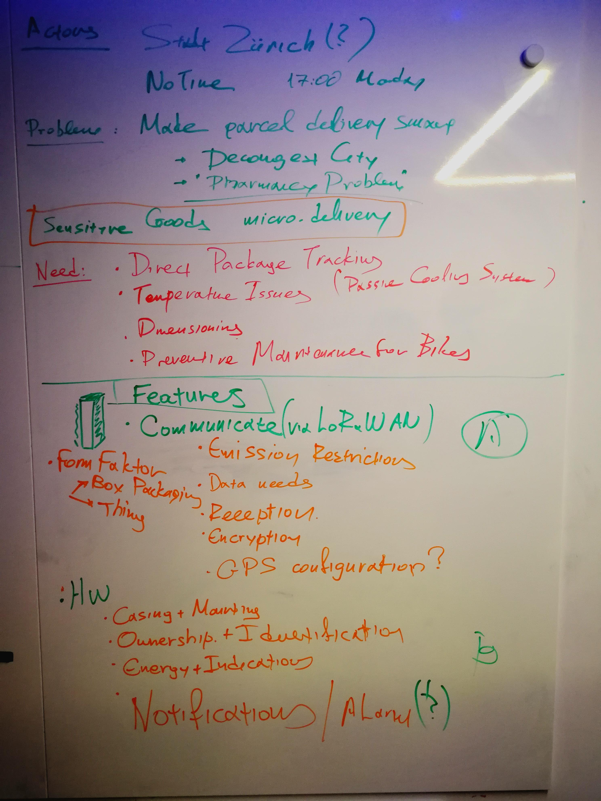
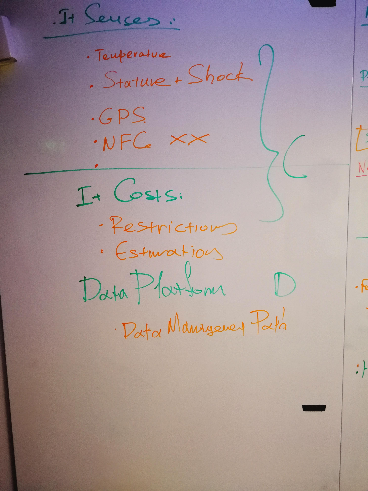

# Follow-up notes for meeting #1

# Features

## Communication (Martin)

### Questions

+ Can GPS talk from a box? Where it needs to be?
+ What sensors does the FMLR TrackerTwo have?
+ Have safe is the data on transmission uplink/downlink?
+ How often do we need to transmit data? How often we can? (LoRaWAN)

## Hardware (Reto)

## Sensing (Antonias)

## Dataplatform (...)

console.thethingsnetwork.org
platform.makezurich.ch